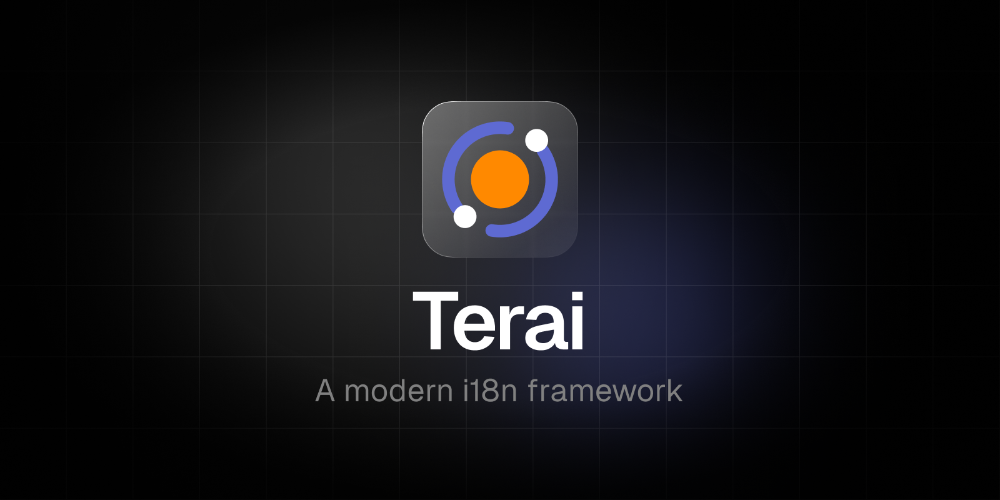
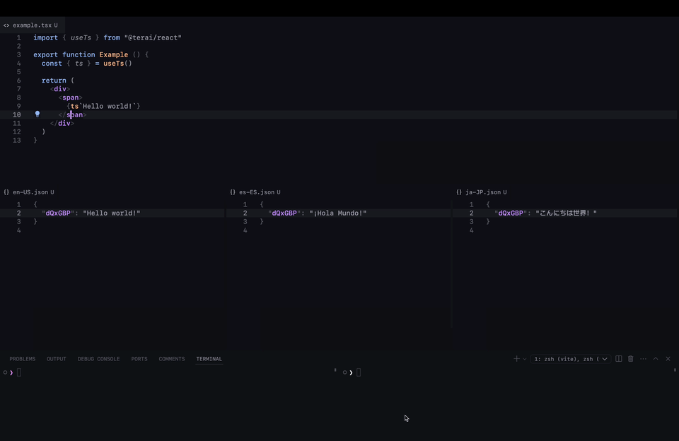

 

  <b>Terai is a i18n framework for Typescript applications. Built for the open source community and optimized for developer experience in the frameworks you love.</b>

  <h4>
    <a href="https://terai-labs.github.io/terai">
      Website
    </a>
     | 
    <a href="https://terai-labs.github.io/terai/docs">
      Documentation
    </a>
     | 
    <a href="https://github.com/terai-labs/terai/issues">
      Issues
    </a>
     | 
    <a href="https://github.com/terai-labs/terai/contributing">
      Contributing
    </a>
     | 
    <a href="https://github.dev/terai/terai/blob/master/CHANGELOG.md">
      Changelog
    </a>
  </h4>

> [!WARNING]  
> **Terai** is currently in development preview with unstable dependencies.
While not planned, we may need to introduce breaking changes in these dependencies on the road to v1.0.

## Introduction

**Terai** is a developer-first open-source localization framework for JavaScript that aims to remove the pain in the localization process.

Workflow can be broken down into 3 steps:

- 1️⃣ **Develop**: incorporate your translation source messages into your project using our dedicated SDKs.
- 2️⃣ **Extract**: streamline your extraction process by automatically gathering all the messages within your project.
- 3️⃣ **Translate**: use your defined translator to get your localized messages.

More documentation available at [https://terai-labs.github.io/terai](https://terai-labs.github.io/terai).

## Quick Demo

## Features

- 🚀 **Speed**: Remove the pain in the localization process. Translate your products **10x faster**.
- 🧑‍💻 **Developer-focused**: One of our main goal was improving the developer experience. No more looking for keys in your source code, no more editing localisation files, and no more manual exporting data for translators.
- 🏆 **Javascript-based**: designed to be used in any javascript-based environment with specific integrations for all major frameworks: Node, React, Next...
- 🤖 **Translation**: Let the machines work for you. We natively support ChatGPT, Google Translate (and more to come), or use your custom translation service.
- 🕋 **Cache**: Don’t translate the same string twice. Translation cache reuses strings you’ve already translated.
- 🌱 **Lightweight**: offer your product to your audience in the way they understand better with just a few KB.
- ✂️ **Code splitting**: Split your translation files with ease. Just import the messages your user needs to see.
- 💎 **TypeScript**: Full-written in TypeScript.
- ⭐️ **MIT Licensed**: Free for personal and commercial use.

## Packages

| Package | Description | Version | Size | Downloads |
| :------ | :---- |  :-----: | :--: | :-------: |
| `@terai/dev` | Dev package for **Terai** |  |  |  |
| `@terai/react` | **Terai** for **React** |  |  |  |
| `@terai/react-native` | **Terai** for **React Native** |  |  |  |
| `@terai/next` | **Terai** for **Next** (WIP) |  |  |  |
| `@terai/node` | **Terai** for **Node** |  |  |  |

## Getting Started

Visit [https://terai-labs.github.io/terai/docs/overview/getting-started](https://terai-labs.github.io/terai/docs/overview/getting-started) to get started with **Terai**.

## Documentation

Visit <a aria-label="terai learn" href="https://terai-labs.github.io/terai">https://terai-labs.github.io/terai</a> to view the full documentation.

## Community

The **Terai** community can be found on [GitHub Discussions](https://github.com/terai/terai/discussions), where you can ask questions, voice ideas, and share your projects.

Our [Code of Conduct](https://github.com/terai/terai/blob/master/CODE_OF_CONDUCT.md) applies to all **Terai** community channels.

## Contributing

Please see our [contributing.md](/contributing.md).

### Good First Issues

We have a list of [good first issues](https://github.com/terai/terai/labels/good%20first%20issue) that contain bugs that have a relatively limited scope. This is a great place to get started, gain experience, and get familiar with our contribution process.

## Authors

- Hugo Corta ([@hugocxl](https://github.com/hugocxl))

## License

MIT License © 2023-Present [Hugo Corta](https://github.com/hugocxl)
